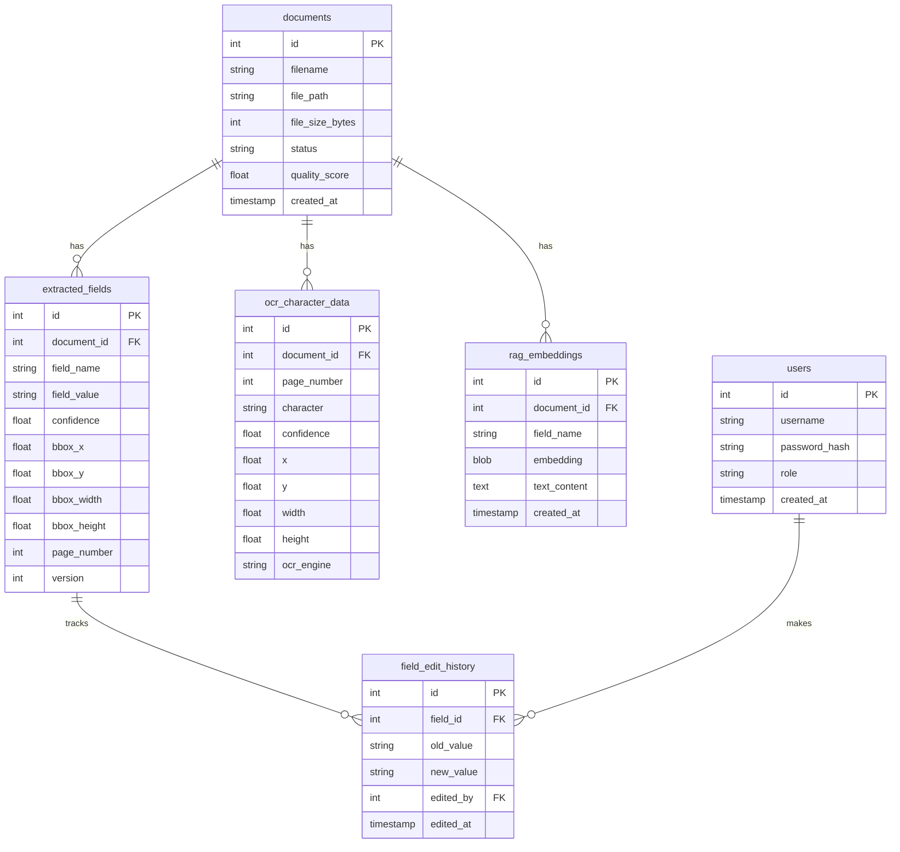

# Database Schema

PDF Manager uses SQLAlchemy with SQLite (development) or PostgreSQL (production).

## Entity-Relationship Overview

## Table Descriptions

### `documents`

Stores metadata for each uploaded PDF.

| Column | Type | Description |
|--------|------|-------------|
| `id` | INTEGER PK | Auto-increment |
| `filename` | TEXT | Original filename |
| `file_path` | TEXT | Absolute path on disk |
| `file_size_bytes` | INTEGER | File size |
| `status` | TEXT | `uploaded`, `extracting`, `extracted`, `error` |
| `quality_score` | REAL | Document quality score (0–100) |
| `created_at` | TIMESTAMP | Upload timestamp |

### `extracted_fields`

Stores key/value pairs extracted from documents.

| Column | Type | Description |
|--------|------|-------------|
| `id` | INTEGER PK | |
| `document_id` | INTEGER FK | References `documents.id` |
| `field_name` | TEXT | e.g., `Name`, `City`, `Phone` |
| `field_value` | TEXT | Extracted or edited value |
| `confidence` | REAL | 0.0 – 1.0 |
| `bbox_x/y/width/height` | REAL | Bounding box on page |
| `page_number` | INTEGER | 1-based page number |
| `version` | INTEGER | Increments on edit |

### `field_edit_history`

Audit trail for field edits.

| Column | Type | Description |
|--------|------|-------------|
| `id` | INTEGER PK | |
| `field_id` | INTEGER FK | References `extracted_fields.id` |
| `old_value` | TEXT | Value before edit |
| `new_value` | TEXT | Value after edit |
| `edited_by` | INTEGER FK | References `users.id` |
| `edited_at` | TIMESTAMP | Edit timestamp |

### `ocr_character_data`

Per-character OCR results for heatmap generation.

### `rag_embeddings`

Stores HuggingFace sentence embeddings for RAG retrieval.

### `users`

Flask-Login user accounts. Passwords are hashed with bcrypt.
