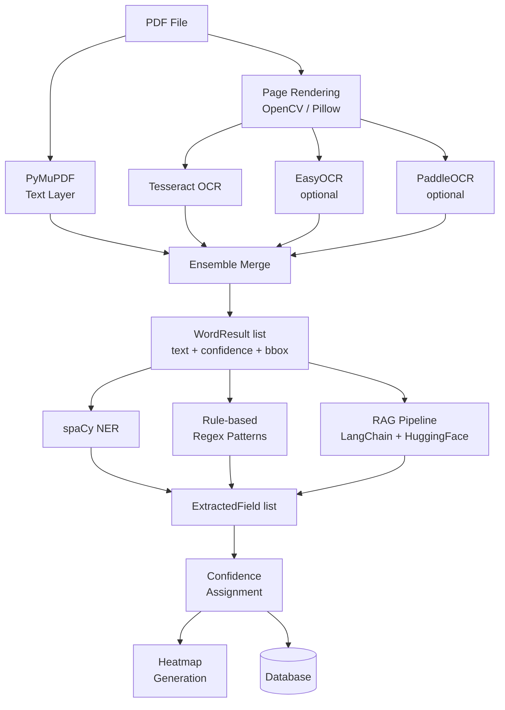

# OCR and RAG Pipeline

## Pipeline Overview

## OCR Ensemble

The OCR layer runs up to four engines in parallel and merges results:

1. **PyMuPDF** extracts the text layer directly from digital PDFs. This is instantaneous and very accurate for non-scanned documents.
2. **Tesseract** is always available as a fallback for scanned/image PDFs.
3. **EasyOCR** (optional) improves accuracy on complex layouts and non-standard fonts.
4. **PaddleOCR** (optional) excels at CJK characters and handwritten text.

The merge algorithm:
- Groups words by approximate bounding box position
- For overlapping words, selects the result with the highest confidence score
- Returns a unified `WordResult` list

## Confidence Thresholds

| Level | Threshold | Badge |
|-------|-----------|-------|
| High | ≥ 0.85 | 🟢 Green |
| Medium | 0.65 – 0.84 | 🟡 Yellow |
| Low | < 0.65 | 🔴 Red |

These thresholds are consistent across backend (`confidence_calculator.py`, `heatmap_generator.py`) and frontend (`FieldsEditor.js`, `OCRConfidenceHeatmap.js`).

## Field Detection

### Rule-based Patterns

The `FieldDetector` uses regular expressions to identify common fields:

| Field | Example Pattern |
|-------|----------------|
| Phone | `\b\d{10}\b` or `\(\d{3}\)\s*\d{3}-\d{4}` |
| Email | Standard email regex |
| Zip Code | `\b\d{5}(-\d{4})?\b` |
| Name | Appears after "Name:" label |
| City | Appears after "City:" label |

### spaCy NER

For fields without clear labels, spaCy's `en_core_web_sm` model detects:
- `PERSON` → Name field
- `GPE` → City/State field
- `ORG` → Organisation field

## RAG Pipeline

The RAG (Retrieval-Augmented Generation) pipeline uses:

- **Embeddings model:** `all-MiniLM-L6-v2` (sentence-transformers)
- **Vector store:** In-memory FAISS index (rebuilt per document)
- **Orchestration:** LangChain

### Steps

1. OCR text is split into chunks
2. Each chunk is embedded using `all-MiniLM-L6-v2`
3. A query per field type (e.g., "What is the person's name?") retrieves the top-k most similar chunks
4. A QA prompt extracts the field value from the retrieved context
5. The result refines or confirms the rule-based/NER value

RAG text files are saved to `rag_data/` as `RAG1.txt`, `RAG2.txt`, etc. for debugging and reuse.

## Heatmap Generation

The `HeatmapGenerator` projects word confidence onto a grid:

- Grid dimensions: 40 columns × 56 rows (approximately A4 at standard resolution)
- Each cell represents a region of the page
- Cell colour is determined by the average confidence of words in that region
- The result is returned as both a JSON grid and optionally a base64-encoded PNG
