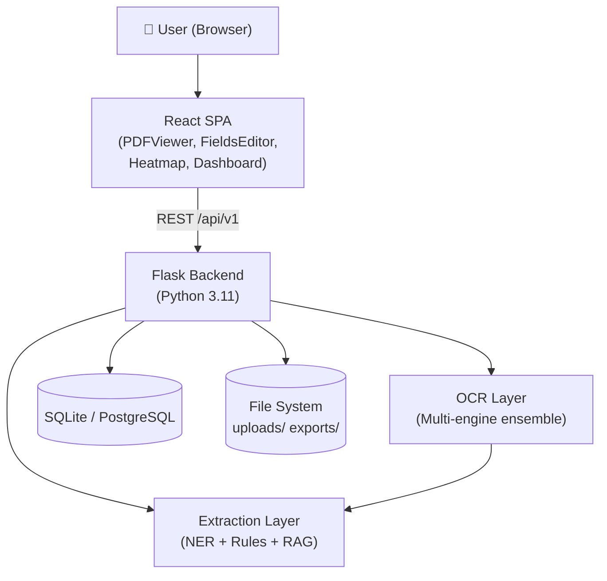
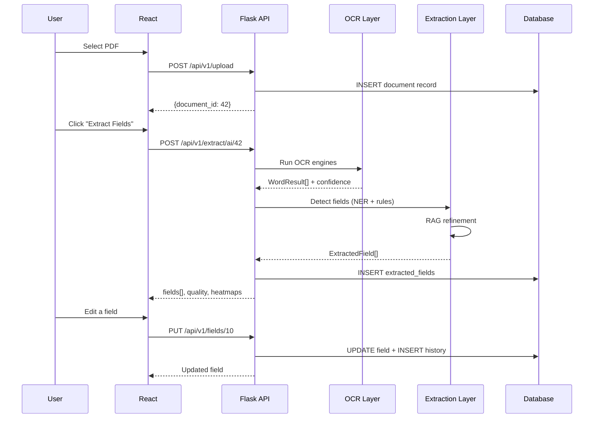
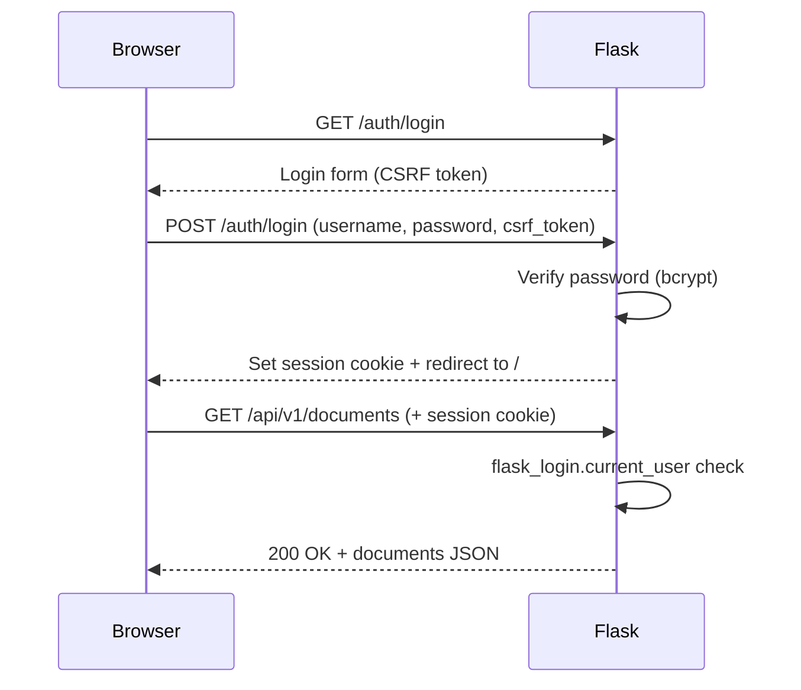
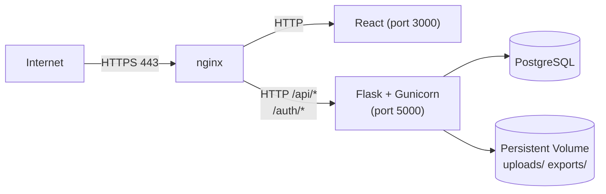

# System Architecture Overview

## High-Level Diagram

## System Components

| Component | Technology | Role |
|-----------|-----------|------|
| **Browser** | React 18 | Upload, view, edit, export |
| **Flask Backend** | Python 3.11, Flask 3.0 | API server, auth, business logic |
| **OCR Layer** | Tesseract, EasyOCR, PaddleOCR | Text extraction from images |
| **Extraction Layer** | spaCy, LangChain, HuggingFace | Field detection and refinement |
| **ORM** | SQLAlchemy | Database abstraction |
| **Database** | SQLite / PostgreSQL | Persistent storage |
| **File System** | Local disk / cloud volume | PDF file storage |

## Data Flow

## Authentication Flow

## Deployment Architecture (Production)

In a cloud deployment, PostgreSQL is replaced by a managed database service and the persistent volume by object storage (S3, GCS, Azure Blob).
