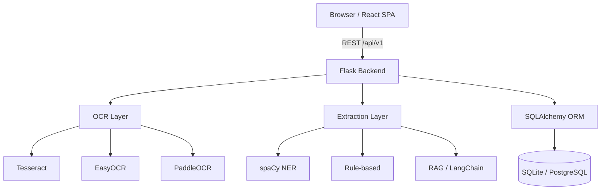

<div class="hero">
  <h1>📄 PDF Manager</h1>
  <p>Production-ready PDF data extraction with Triple OCR engines, AI/RAG pipeline, and interactive editing</p>
  <div class="cta-buttons">
    <a href="installation/docker/" class="cta-button cta-primary">🚀 Quick Start</a>
    <a href="api/" class="cta-button cta-secondary">📖 API Docs</a>
  </div>
</div>

## What is PDF Manager?

**PDF Manager** is a full-stack, production-ready application that combines three OCR engines with an AI/RAG pipeline to intelligently extract structured data from PDF documents. Upload a PDF, let the system extract fields automatically, edit interactively in a split-view editor, and export results as JSON or CSV — all with confidence scores and full audit trails.

---

## Key Features

<div class="feature-grid">
  <div class="feature-card">
    <div class="icon">📤</div>
    <h3>PDF Upload</h3>
    <p>Drag-and-drop or browse; supports PDFs up to 50 MB</p>
  </div>
  <div class="feature-card">
    <div class="icon">🔍</div>
    <h3>Triple OCR Engine</h3>
    <p>Tesseract + EasyOCR + PaddleOCR with ensemble confidence scoring</p>
  </div>
  <div class="feature-card">
    <div class="icon">🤖</div>
    <h3>AI Field Extraction</h3>
    <p>NER (spaCy) + rule-based + RAG (LangChain + HuggingFace)</p>
  </div>
  <div class="feature-card">
    <div class="icon">🔥</div>
    <h3>Confidence Heatmaps</h3>
    <p>Pixel-wise Green/Yellow/Red visualisation per word</p>
  </div>
  <div class="feature-card">
    <div class="icon">📊</div>
    <h3>Performance Dashboard</h3>
    <p>Document quality score, regional scores, word confidence breakdown</p>
  </div>
  <div class="feature-card">
    <div class="icon">🖊️</div>
    <h3>Inline Editing</h3>
    <p>Split layout: PDF viewer on the left, editable fields on the right</p>
  </div>
  <div class="feature-card">
    <div class="icon">⬇️</div>
    <h3>Export</h3>
    <p>JSON or CSV with full metadata and confidence scores</p>
  </div>
  <div class="feature-card">
    <div class="icon">📜</div>
    <h3>Edit History</h3>
    <p>All field edits are versioned and audited</p>
  </div>
</div>

---

## Architecture Overview



See the [Architecture](architecture/overview.md) section for full diagrams and component descriptions.

---

## Quick Start

=== "Docker (Recommended)"

    ```bash
    git clone https://github.com/rahulmisra2010-ctrl/PDF-Manager.git
    cd PDF-Manager
    docker compose up --build
    ```

    | Service | URL |
    |---------|-----|
    | Frontend (React) | <http://localhost:3000> |
    | Backend (Flask + API) | <http://localhost:5000> |
    | Admin Login | <http://localhost:5000/auth/login> |

=== "Manual"

    ```bash
    git clone https://github.com/rahulmisra2010-ctrl/PDF-Manager.git
    cd PDF-Manager
    python -m venv .venv && source .venv/bin/activate
    pip install -r backend/requirements.txt
    cp .env.example .env   # edit values
    python app.py           # http://localhost:5000
    ```

---

## Technology Stack

| Layer | Technology |
|-------|-----------|
| **Frontend** | React 18, react-pdf |
| **Backend** | Flask 3.0+ (Python 3.11) |
| **PDF Parsing** | PyMuPDF |
| **Image Processing** | OpenCV, Pillow |
| **OCR** | Tesseract, EasyOCR, PaddleOCR |
| **AI / NLP** | spaCy, LangChain, sentence-transformers |
| **Database** | SQLite (dev) / PostgreSQL (production) |
| **ORM** | SQLAlchemy |
| **Containerisation** | Docker Compose |

---

## Documentation Sections

| Section | Description |
|---------|-------------|
| [Installation](installation/index.md) | Docker, manual, and cloud deployment setup |
| [User Guide](user-guide/index.md) | How to upload, extract, edit, and export |
| [API Reference](api/index.md) | Complete REST API documentation with examples |
| [Deployment](deployment/index.md) | Production deployment, scaling, and monitoring |
| [Development](development/index.md) | Contributing, code style, and testing |
| [Architecture](architecture/index.md) | System design, components, and data flow |
| [Troubleshooting](troubleshooting/index.md) | FAQ, common issues, and error reference |

---

## License

PDF Manager is released under the [MIT License](https://github.com/rahulmisra2010-ctrl/PDF-Manager/blob/main/LICENSE).
